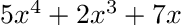
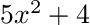
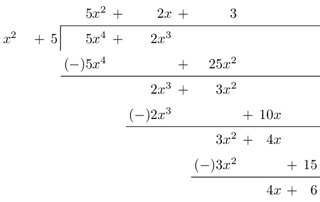

# Polynomial Modular Longdivision

Just a Python3 script to layout polynomial modular longdivision in
LaTeX, which is generally a complete chore.

## Usage

As an example, dividing  by  in :

- As data:

```bash
python3 PolyModDiv.py -a 5 2 0 7 0 -b 5 0 4 -n 7
```
```
original_ax=[5, 2, 0, 7, 0]
original_bx=[5, 0, 4]
         ax=[5, 2, 0, 0, 0]
         bx=[1, 0, 5]
         qx=[5, 2, 3]
         rx=[4, 6]
division_steps=[
    ([5, 0, 25, 0, 0], [2, 3, 0, 0])
    ([2, 0, 10, 0], [3, 4, 0])
    ([3, 0, 15], [4, 6])
]
```

- Or as a LaTeX table:

```bash
python3 PolyModDiv.py -a 5 2 0 7 0 -b 5 0 4 -n 7 -t
```
```
\begin{tabular}{*{14}{R}}
&&&&&5x^2&+&2x&+&3\\\cline{6-14}
x^2& & &+&\multicolumn{1}{R|}{5}&5x^4&+&2x^3& & & & & & \\
&&&&&(-)5x^4& & &+&25x^2& & & & \\\cline{6-14}
&&&&&&&2x^3&+&3x^2& & & & \\
&&&&&&&(-)2x^3& & &+&10x& & \\\cline{8-14}
&&&&&&&&&3x^2&+&4x& & \\
&&&&&&&&&(-)3x^2& & &+&15\\\cline{10-14}
&&&&&&&&&&&4x&+&6\\
\end{tabular}
```

- Or as a standalone LaTeX document:

```bash
python3 PolyModDiv.py -a 5 2 0 7 0 -b 5 0 4 -n 7 -T > sample.tex
lualatex sample.tex
```

Which produces:


